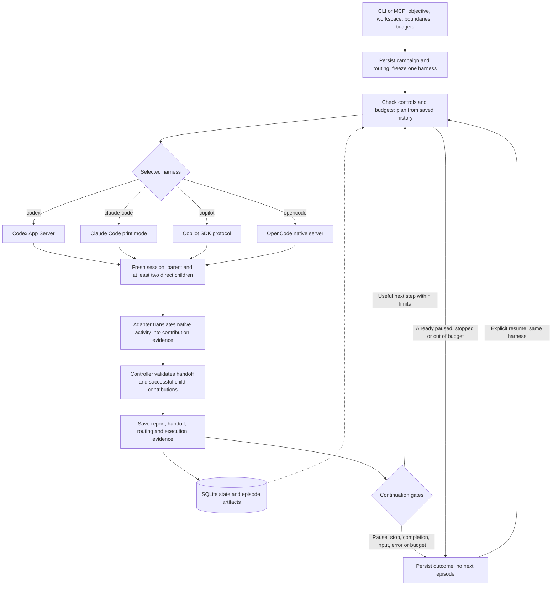

# JAM Mode

JAM Mode is a local plugin and companion controller for **bounded, adaptive campaigns across naturally ending fresh sessions**.

Campaigns can select Codex, Claude Code, GitHub Copilot CLI, or OpenCode. Each
campaign keeps one harness across all episodes and resumes. Existing campaigns
continue to use Codex. The new adapters use existing signed-in accounts; see
[harness setup and current compatibility limits](docs/harnesses.md).

A campaign keeps one durable objective while allowing the work to move through investigation, planning, implementation, review, validation, documentation, data processing, operations, content production, or closure. Before each episode, JAM reviews the previous transcript, structured handoffs, cumulative campaign state, and explicit memory paths. Codex campaigns also load relevant Codex memories and Chronicle entries. JAM then selects the next bounded objective, task profile, and multi-agent strategy.

Each episode uses a fresh session in the campaign's selected harness. JAM saves a human-readable report and machine-readable handoff, verifies child contributions, and applies operating-boundary, user-input, progress, expected-value, plateau, and budget gates before continuing. Pausing JAM means **finish the current episode and do not start another**; it does not interrupt an active turn. Errors and episode deadlines can end execution early.

## Campaign execution model



Only the selected adapter runs. The controller owns continuation; child agents cannot launch the next episode. Compatibility or execution failures stop the campaign without switching harnesses. Successful work requires substantive, delivered results from at least two distinct direct children; a parent's claim that delegation happened is insufficient. Blocked or needs-input handoffs can stop for user intervention without claiming successful work.

## Choose a harness

Harness selection controls how JAM runs sessions and agents. Model selection controls which model that harness uses: selecting a Claude model through Copilot still creates a Copilot campaign. Mixed-harness agents are deferred.

| Harness | Implemented contract | Account and main limits |
|---|---|---|
| `codex` (default) | Existing Codex App Server integration | Existing Codex account; Codex routing presets and managed agents. Historical campaigns retain this harness. |
| `claude-code` | Experimental; Claude Code 2.1.219+ with forwarded child events | Existing personal Pro/Max sign-in on unmanaged native Windows/Linux. WSL, macOS, and managed accounts are refused. |
| `copilot` | Experimental; Copilot CLI 1.0.83, SDK protocol 3 | Existing Copilot sign-in. Other CLI versions and per-role effort overrides are refused. |
| `opencode` | Experimental; OpenCode 1.18.30 | Existing GitHub Copilot OAuth in OpenCode. Requires `github-copilot/<model-id>`; other providers and effort variants are unsupported. |

The three new adapters have protocol and process tests, but no live account-backed JAM campaign has been verified. They use existing sign-in and do not install tools, log in, or fall back to direct provider API keys. The parent owns authorized edits and all children have read tools only. Shell commands are unavailable, so these adapters cannot run executable tests. Copilot and OpenCode also reject task network access. See [harness setup and limits](docs/harnesses.md) before starting.

From the repository root, inspect support without running model tasks:

```bash
python3 plugins/jam-mode/scripts/jam.py harnesses
python3 plugins/jam-mode/scripts/jam.py doctor --harness claude-code
python3 plugins/jam-mode/scripts/jam.py models --harness copilot
```

Use Python 3.11 or later (`python` or `py -3` on Windows). Python and the harness executable must run on the same host. The portable launcher works without the Codex plugin; an installed `jam` command accepts the same arguments. [INSTALL.md](INSTALL.md) covers the Codex plugin installation, and the [MCP setup](docs/harnesses.md#calling-jam-through-mcp) covers other clients.

## Codex model routing

For Codex campaigns, JAM provides a routing layer for selecting the model and reasoning effort used by the parent and each delegated role.

- Five routing policies: `inherit`, `economy`, `balanced`, `quality`, and `custom`.
- Per-role model and reasoning-effort overrides.
- Named Codex custom agents such as `jam_explorer`, `jam_implementer`, and `jam_reviewer`.
- Installed-account validation through Codex App Server `model/list`.
- `strict`, `fallback`, and `off` validation modes.
- Separate opt-ins for parent Ultra and child Ultra.
- Strategy-to-agent routing with a one-writer rule for shared workspaces.
- Persisted requested and resolved rosters per campaign and episode.
- App Server collaboration activity, model events, and token-usage artifacts when available.
- Safe agent management: JAM modifies only files carrying the `# JAM_MODE_MANAGED=1` marker and refuses project-level name collisions.

Model IDs and effort levels in a preset are requests, not assumptions. With the default `strict` validation, JAM asks the installed Codex client which models and reasoning efforts are available and refuses to start unless the requested roster is available exactly. `fallback` is an explicit opt-in that permits model substitutions.

## Default Codex balanced roster

A fresh installation uses the `balanced` policy with `strict` validation:

| Role | Managed agent | Requested model | Requested effort | Purpose |
|---|---|---|---|---|
| Parent / synthesizer | primary thread | `gpt-6-astra` | `high` | Episode decisions, arbitration, synthesis, final response |
| Explorer | `jam_explorer` | `gpt-6-astra` | `medium` | Read-heavy mapping, retrieval, and evidence gathering |
| Bulk worker | `jam_bulk_worker` | `gpt-6-astra` | `low` | Clear, separable, repeatable shards |
| Planner | `jam_planner` | `gpt-6-astra` | `high` | Decomposition, dependencies, and acceptance criteria |
| Implementer | `jam_implementer` | `gpt-6-astra` | `high` | The single code/configuration/data writer |
| Producer | `jam_producer` | `gpt-6-astra` | `high` | The single document/content deliverable writer |
| Reviewer | `jam_reviewer` | `gpt-6-astra` | `high` | Correctness, security, regression, and acceptance review |
| Validator | `jam_validator` | `gpt-6-astra` | `medium` | Tests, reproductions, measurements, and falsification |
| Critic | `jam_critic` | `gpt-6-astra` | `high` | Adversarial challenge and competing explanations |
| Closer | `jam_closer` | `gpt-6-astra` | `high` | Completion assessment and final consolidation |

`economy`, `balanced`, and `quality` all use GPT-6-Astra. They differ only in reasoning effort: economy requests lower effort, while quality requests higher effort. `inherit` leaves every role to ordinary Codex inheritance. `custom` provides an empty base for explicit role assignments.

## Codex routing validation

| Mode | Behavior |
|---|---|
| `strict` | Refuse to save or start when a requested model or effort is unavailable |
| `fallback` | Select a role-appropriate available model or nearest supported effort and record a warning |
| `off` | Materialize the requested settings without calling `model/list` |

JAM accepts `minimal`, `low`, `medium`, `high`, `xhigh`, `max`, and `ultra`, but catalog validation determines which values the selected model actually supports. Child Ultra is disabled by default because it can introduce nested delegation and less predictable topology or usage. Parent and child Ultra have separate switches. When a child role is explicitly allowed and resolves to `ultra`, its generated instructions permit at most one read-only helper at a time, one generation deep; nested writers, JAM controls, and scope expansion remain prohibited.

Custom-agent `sandbox_mode` is a default, not an absolute capability boundary: Codex can reapply the parent turn's live sandbox and approval overrides to spawned agents. JAM therefore also enforces the one-writer/read-only roles through explicit role instructions and campaign boundaries; use a read-only parent episode when a hard read-only runtime is required for every child.

## Task profiles

The campaign preference defaults to `adaptive`. Each fresh episode may select a more specific profile after reviewing the current objective and campaign state.

| Profile | Typical use |
|---|---|
| `adaptive` | Let each episode select the best profile |
| `general` | Clear bounded work without a specialist contract |
| `research` | Investigation, comparison, explanation, and evidence building |
| `security_research` | Authorized security investigation under explicit boundaries |
| `engineering` | Code, tests, configuration, migrations, refactors, and tooling |
| `review` | Audits, critiques, verification, and approval evidence |
| `documentation` | Technical or user documentation, examples, and migration guides |
| `planning` | Designs, decisions, milestones, dependencies, and executable plans |
| `data` | Inspection, transformation, quality checks, analysis, and reporting |
| `operations` | Bounded actions with verification, approval, and rollback awareness |
| `content` | Prose, structured content, creative material, and communications |
| `mixed` | One episode intentionally combines several profiles |

A campaign can move naturally through sequences such as:

```text
research → engineering → review → documentation → closure
planning → engineering → execute_validate → closure
data → documentation/content → review → closure
content → producer_critic → revision → closure
operations planning → user approval → execute_validate → closure
```

## Adaptive strategies and named routes

Top-level JAM episodes are serial. Inside an episode, `duo_independent` is the default: an explorer and critic investigate independently before the parent synthesizes their findings and performs authorized work. Every strategy requires at least two distinct direct children. Solo execution is not an available fallback.

| Strategy | Named-agent route |
|---|---|
| `parallel_explore` | `jam_explorer` × N → parent synthesis |
| `critique_synthesize` | `jam_critic` + `jam_reviewer` → parent |
| `map_reduce` | `jam_bulk_worker` × N → parent aggregation |
| `builder_reviewer` | `jam_implementer` → `jam_reviewer` → parent |
| `planner_executor` | `jam_planner` → one appropriate writer → parent |
| `producer_critic` | `jam_producer` → `jam_critic` → parent |
| `execute_validate` | One writer → `jam_validator` → parent |
| `duo_independent` | `jam_explorer` + `jam_critic` → parent |
| `discover_reproduce` | `jam_explorer` + `jam_validator` → parent |
| `evidence_arbitration` | `jam_reviewer` + `jam_critic` → parent |
| `reorientation` | `jam_planner` + `jam_critic` → parent |
| `closure` | `jam_closer` + `jam_reviewer` → parent |

The route is a deterministic baseline. Independent assignments can run together; dependent roles run in order. `parallel_explore` and `map_reduce` use at least two instances of the listed role. A missing contribution prevents successful completion; stale results, failed or cancelled children, and nested helpers cannot stand in for the two required direct children.

There is never more than one writer in a shared checkout. For Claude Code, Copilot, and OpenCode, implementer and producer roles return read-only proposals and the parent performs all authorized edits. Codex can assign one child writer where the chosen strategy calls for it.

## Included components

- A local Codex marketplace and plugin manifest.
- A `$jam-mode` / `@JAM Mode` skill.
- A dependency-free stdio MCP server exposing campaign and routing controls.
- A detached Python controller with Codex, Claude Code, Copilot, and OpenCode execution adapters.
- One fresh harness session per episode, a structured handoff, and verified child-contribution evidence.
- A SQLite store shared by Desktop, CLI, MCP, and detached controllers.
- A `jam` terminal command.
- WSL/Linux and native Windows installers and uninstallers.
- Automated unit, MCP smoke, protocol, migration, installer, fake harness transport, and process-lifecycle tests.

JAM intentionally permits one live campaign and one active top-level episode at a time. The campaign’s `max_subagents` setting caps requested parallelism inside an episode and must be between 2 and 16.

# Installation

See [INSTALL.md](INSTALL.md) for the full guide.

## Codex Windows Desktop with WSL2 CLI

Use the same Codex host for Desktop and CLI. In Codex Desktop, switch the agent runtime to **WSL**, restart Desktop, and point WSL at the Windows Codex home:

```bash
export CODEX_HOME="/mnt/c/Users/<WindowsUser>/.codex"
export PATH="$HOME/.local/bin:$PATH"
```

From the extracted release:

```bash
cd jam-mode-marketplace
python3 plugins/jam-mode/scripts/validate_plugin.py plugins/jam-mode
bash plugins/jam-mode/scripts/install-wsl.sh
jam doctor
jam models
jam routing
```

Restart Desktop and open a new Desktop chat or CLI session so the plugin, skill, MCP server, and generated custom agents are reloaded.

## Native Windows

```powershell
Set-ExecutionPolicy -Scope Process Bypass
cd jam-mode-marketplace
py -3 .\plugins\jam-mode\scripts\validate_plugin.py .\plugins\jam-mode
.\plugins\jam-mode\scripts\install-windows.ps1
jam doctor
jam models
jam routing
```

The native installer creates `jam.cmd` under `%CODEX_HOME%\bin` by default. Add that directory to `PATH` when necessary.

# Configure Codex model routing

This section describes Codex presets, account-catalog validation, Ultra, and managed agent files. Claude Code, Copilot, and OpenCode default independently to `inherit` with `strict` validation and accept `inherit`/`custom` policies. Their adapters check observed model identity during execution; cross-model fallback and Codex Ultra settings are unsupported. See [native routing details](docs/harnesses.md#start-and-resume).

## Inspect the installed model catalog

```bash
jam models
jam models --hidden
```

Each entry shows the default and advertised reasoning efforts reported by the installed Codex account.

## Inspect or select a policy

```bash
jam routing
jam routing --policy economy --validation strict
jam routing --policy balanced --validation strict
jam routing --policy quality --validation strict
jam routing --policy inherit
```

Global defaults live at `$CODEX_HOME/jam-mode/config.toml`. Configure them through `jam routing` or `jam_configure_model_routing` so the generated custom-agent files remain synchronized. `jam_configure_model_routing` also accepts a paused campaign id; `jam_refresh_campaign_routing` revalidates a paused campaign without changing its overrides.

## Define a custom roster

```bash
jam routing \
  --policy custom \
  --model gpt-6-astra \
  --effort high \
  --role-model explorer=gpt-6-astra \
  --role-effort explorer=medium \
  --role-model implementer=gpt-6-astra \
  --role-effort implementer=high \
  --role-model reviewer=gpt-6-astra \
  --role-effort reviewer=high
```

Use `inherit` as an override value to clear an explicit assignment and return that role to the selected preset:

```bash
jam routing --role-model explorer=inherit --role-effort explorer=inherit
```

Use `--no-validate` only when deliberately saving requests without checking the installed catalog.

## Configure one paused campaign

A campaign freezes its requested and resolved roster when created. Global changes affect future campaigns. To alter an existing campaign, pause it and wait for its active episode to finish:

```bash
jam pause <campaign-id>
jam routing <campaign-id> --policy quality
jam routing <campaign-id> --role-model reviewer=gpt-6-astra --role-effort reviewer=max
jam routing <campaign-id> --refresh
jam resume <campaign-id>
```

JAM refuses to rewrite its shared custom-agent files while any campaign episode is live.

# Start campaigns

## Signed-in Claude Code campaign

After signing in separately and checking compatibility on the execution host:

```bash
python3 plugins/jam-mode/scripts/jam.py start \
  --harness claude-code \
  --workspace /absolute/path/to/project \
  --objective "Review the design, compare independent findings, and recommend the next change." \
  --max-episodes 1 \
  --max-subagents 2
```

Starting consumes the selected account's normal usage. Campaigns default to read-only; add `--sandbox workspace-write` for authorized edits. Use `--harness copilot` for Copilot, or `--harness opencode --model github-copilot/<model-id>` with a model available through your OpenCode login. The harness is immutable after creation, including on resume. Omit `--harness` to use Codex.

## Codex balanced adaptive software-delivery campaign

```bash
jam start \
  --name "Import workflow delivery" \
  -C ~/src/service \
  --profile adaptive \
  --sandbox workspace-write \
  --model-policy balanced \
  --model-validation strict \
  --objective "Implement the import workflow, validate it, review it, update operator documentation, and stop when all acceptance criteria are verified." \
  --success "Focused and integration tests pass; documentation examples are verified; no material review finding remains." \
  --max-episodes 10 \
  --max-subagents 2
```

For ordinary offline workspace work, omitted operating boundaries become conservative local defaults.

## Codex campaign-level routing overrides

```bash
jam start \
  -C ~/src/project \
  --sandbox workspace-write \
  --model-policy balanced \
  --model gpt-6-astra \
  --effort high \
  --role-model explorer=gpt-6-astra \
  --role-effort explorer=low \
  --role-model reviewer=gpt-6-astra \
  --role-effort reviewer=xhigh \
  --objective "Diagnose the flaky integration test, implement the smallest safe fix, independently review it, and verify the relevant suites."
```

With `strict` validation, an unsupported `xhigh`, `max`, or other setting stops campaign creation rather than silently downgrading it. With `fallback`, the resolved roster and warning are stored in the campaign charter.

## Security-sensitive or networked campaign

Supply explicit operating boundaries:

```bash
jam start \
  --name "Local authorization validation" \
  -C ~/src/service \
  --profile security_research \
  --sandbox read-only \
  --model-policy quality \
  --objective "Confirm or reject whether identifier normalization can expose another local test identity's cached response." \
  --boundaries '{
    "resources": ["this repository", "its local test environment", "local test identities created for this campaign"],
    "allowed_actions": ["read source", "run local non-destructive tests", "inspect local test logs"],
    "excluded_actions": ["production", "third parties", "unrelated hosts", "persistence", "destructive actions"],
    "approval_required_for": ["network access", "scope expansion", "credential use"]
  }' \
  --success "Produce a deterministic reproduction or strong falsification with traceable evidence." \
  --max-episodes 12
```

Explicit boundaries are required when `--network` is requested and should be supplied for production, third-party, credentialed, destructive, deployment, publication, or other elevated work.

## From Codex Desktop

After a successful start or resume, JAM's agent instructions require the invoking task to arrange a quiet heartbeat, normally every five minutes, using Desktop's automation tool. It returns completed reports, failures, or input requests to that task and pauses itself when autonomous work ends. Existing campaign monitors are reused. The agent confirms whether scheduling succeeded; if automation is unavailable or declined, it provides the campaign's status command. The controller continues to own episode execution. See the [follow-up workflow](plugins/jam-mode/skills/jam-mode/references/campaign-follow-up.md).

```text
@JAM Mode Start a balanced adaptive workspace-write campaign for this repository.

Objective:
Implement the requested feature, validate it, independently review it, update the
relevant documentation, and close only when the acceptance criteria are verified.

Limits:
- Maximum 8 episodes
- Maximum 2 subagents
```

## From Codex CLI

```text
$jam-mode Configure the balanced model-routing policy, show me the resolved roster,
then start a bounded campaign for this repository to diagnose and fix the flaky test.
```

# Campaign controls

```bash
jam status
jam --json status
jam list
jam pause
jam resume
jam resume --guidance "Prioritize runtime reproduction over additional static analysis."
jam stop
jam add-memory ./notes
jam log --tail 200
jam doctor
```

- `pause`: the active episode finishes naturally; no successor starts.
- `resume`: keeps the saved harness, revalidates its routing, reviews persisted state, and plans a fresh episode. Codex also rematerializes its managed agents.
- `stop`: ends autonomous continuation after the active episode; an explicit later resume can reopen the campaign.
- `status`: shows the saved harness, campaign state, latest episode, selected profile/strategy, parent model, routing warnings, session id, and artifacts.

# Persistent state and artifacts

By default, JAM stores state under `$CODEX_HOME/jam-mode` (or `~/.codex/jam-mode`). Set `JAM_HOME` to use another directory; all clients must share it to see the same campaigns.

```text
config.toml                         global routing defaults
jam.db                             campaign and episode state
campaigns/<campaign-id>/charter.json
campaigns/<campaign-id>/campaign.md
campaigns/<campaign-id>/episodes/NNNN/
  context.json
  prompt.md
  events.jsonl
  report.md
  handoff.json
  routing.json
  agent-activity.json
  model-events.json
  token-usage.json
  app-server.stderr.log
```

The campaign stores its harness and both the **requested** and **resolved** rosters. Episode artifacts snapshot the intended roster and retain contribution and model observations separately. The three new adapters also retain native logs alongside canonical evidence; token usage may be unavailable. The shared stderr filename remains `app-server.stderr.log` for all harnesses.

For Codex, managed custom-agent files are written to `$CODEX_HOME/agents/jam_*.toml`. JAM refuses to overwrite an unmarked file with the same name. It also refuses to start a Codex campaign in a workspace containing `.codex/agents/jam_*.toml`, because project-scoped files would override the managed personal agents. The other adapters prepare their own scoped agent configuration and do not write Codex agent files.

A Codex role's `sandbox_mode` is a custom-agent default, not an unconditionally stronger permission boundary: live turn/session permission overrides can supersede it. JAM therefore repeats the role boundary in each managed agent's developer instructions and still applies the campaign sandbox and operating-boundary checks at the parent/controller level. The other adapters enforce tool permissions through their native harness; these controls do not constitute an OS sandbox.

# Upgrade from 0.1 or 0.2

Run the 0.3 installer over the extracted 0.3 marketplace. Do not delete `$CODEX_HOME/jam-mode`.

```bash
bash plugins/jam-mode/scripts/install-wsl.sh
```

or:

```powershell
.\plugins\jam-mode\scripts\install-windows.ps1
```

Existing SQLite state is migrated in place. Version 0.1 research handoffs remain unchanged on disk and are normalized when read. Version 0.2 task-general campaigns receive the new routing fields when the database is opened. Campaigns created before harness selection default to `codex`. The installer creates a default routing config when one does not exist and materializes the JAM-managed agent files without requiring a live model-catalog call; Codex campaign start and resume perform account-specific validation.

A backup before any upgrade is prudent:

```bash
cp -a "$CODEX_HOME/jam-mode" "$CODEX_HOME/jam-mode.backup"
```

# Uninstall

WSL/Linux:

```bash
bash plugins/jam-mode/scripts/uninstall-wsl.sh
```

Native Windows:

```powershell
.\plugins\jam-mode\scripts\uninstall-windows.ps1
```

The uninstallers remove the plugin, marketplace copy, companion command, and only marker-owned `jam_*.toml` files. They preserve `$CODEX_HOME/jam-mode`, including campaign history and routing configuration.

# Safety and operating model

- One active top-level campaign episode at a time.
- Fresh session for every episode, using the campaign's saved harness.
- Two distinct direct child contributions required for successful work; the parent owns final synthesis.
- No autonomous scope expansion.
- One writer in a shared checkout.
- Child agents cannot control campaign continuation and are instructed not to invoke JAM tools.
- Codex child Ultra is opt-in; nested helpers do not replace required direct children.
- Routing changes are blocked while a campaign episode is live.
- Task network access requires explicit boundaries and adapter support.
- The parent, not a child agent, synthesizes the episode result and writes the campaign handoff.
- Continuation is controlled by deterministic gates outside the model turn.

The public plugin surface does not provide a permanent custom Desktop sidebar toggle. JAM implements the intended behavior through `@JAM Mode`, `$jam-mode`, MCP tools, and `jam pause/resume/stop`.

# Development checks

From `plugins/jam-mode`:

```bash
python3 scripts/validate_plugin.py .
python3 -m compileall -q jam mcp scripts
PYTHONDONTWRITEBYTECODE=1 python3 -m unittest discover -s tests -v
bash -n scripts/install-wsl.sh scripts/uninstall-wsl.sh
```

The suite covers plugin layout, MCP restrictions, App Server protocol handling, model-catalog pagination, routing policies, effort fallback, Ultra gates, managed-agent collision safety, global and campaign routing updates, database migration, structured handoffs, continuation gates, transcript/memory handling, a complete fake App Server episode, and WSL installer behavior. Harness tests cover persisted selection, native protocol translation, stale and failed child evidence, parent/child tool permissions, adapter transport wiring, and subprocess cleanup/deadlines.

# Verification limits

The harness implementation was checked with synthetic protocol fixtures, fake transports, local process tests, and replay of recorded Codex campaign evidence. These checks do not establish a live account-backed campaign for Claude Code, Copilot, or OpenCode. Installed versions and account access can differ from the implemented contracts. Run `jam harnesses`, `jam doctor --harness <id>`, and `jam models --harness <id>` on the target host after installation or harness updates; discovery does not run model tasks. See [compatibility and observed availability](docs/harnesses.md#setup) for details.
